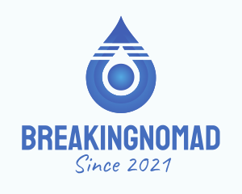

[](https://github.com/rolfwessels/BreakingNomad/releases)
[](https://hub.docker.com/r/rolfwessels/BreakingNomad/tags)
[](https://hub.docker.com/r/rolfwessels/BreakingNomad/tags)
[](https://github.com/rolfwessels/BreakingNomad/licence.md)



# Breaking Nomad 🏕️

Breaking Nomad is a mobile app that helps you plan and prepare for your next camping trip. With Breaking Nomad, you can easily create packing lists 🎒, plan your meals 🍴, and get notified of upcoming long weekends 📅.

## Getting Started 🚀

Open the docker environment to do all development and deployment. Run the following in WSL or bash

```bash
# bring up dev environment
make build up
# test the project
make test
# build the project ready for publish
make publish
```

## Possible features

- **Long Weekend Calendar** Include a calendar feature that shows upcoming long weekends and public holidays for your location.
- **Weekend Getaway Suggestions** Provide suggestions for popular weekend getaway destinations, along with accommodation options and prices.
- **Booking Integration** Integrate with booking platforms such as Booking.com, Airbnb or Expedia to allow users to book their preferred accommodation directly through the app.
- **Alerts and Reminders** Send push notifications or reminders to users a few weeks before a long weekend to prompt them to start planning their trip and booking accommodation.
- **Weather Forecast** Include a weather forecast feature for users to check the weather at their destination before booking their trip.
- **Packing List** Provide a packing list suggestion based on the user's destination, time of year and type of activity they are planning to do.
- **Social Sharing** Enable users to share their weekend getaway with friends that might like to join.
- **Meal Planning** Allow users to plan their meals for the trip by creating a menu that includes breakfast, lunch, and dinner options. They can add ingredients to their shopping list, and the app can suggest meals based on the user's dietary preferences.
- **Grocery List** Create a grocery list feature that will allow users to add food items to their packing list. This will help them to remember everything they need to buy before they leave for their trip.
- **Recipes** Provide users with a selection of recipes for their weekend getaway that are easy to make and require minimal cooking equipment. Users can select from a list of recipes that fit their dietary needs, and the app can automatically add the necessary ingredients to their grocery list.
- **Customization** Allow users to customize their meal plan and grocery list based on the number of people going on the trip, their dietary preferences, and any specific food allergies.

## Technologies Used 🔧

- **Blazor WebAssembly**: A .NET web framework that allows us to build web applications using C# instead of JavaScript.
- **GraphQL**: A query language that enables us to efficiently retrieve data from the server.
- **Hot Chocolate**: A GraphQL server implementation for .NET.
- **NUnit**: A unit testing framework for .NET.
- **Fluent Assertions**: A set of .NET libraries that allow for more natural assertions in tests.

## Available make commands

### Commands outside the container

- `make up` : brings up the container & attach to the default container
- `make down` : stops the container
- `make build` : builds the container
- `docker-login` : Log into docker
- `docker-build` : Build the container
- `docker-push` : Push containers to registry

### Commands to run inside the container

- `make start` : Run the breaking nomad
- `make publish` : Build the breaking nomad to build folder
- `make test` : Build the breaking nomad to build folder
- `make deploy` : Deploy the breaking nomad

## Focus todo list

- [ ] Break the recipes apart
- [ ] Add better unit of measure support
- [ ] Add better ingredient support
- [ ] Add ai generated recipes
- [ ] Store the values in a database instead of in memory
- [ ] 

## License 📝

Breaking Nomad is licensed under the MIT License. See LICENSE for more information.

## Research

- <https://expo.dev/> Make any app. Run it everywhere.
